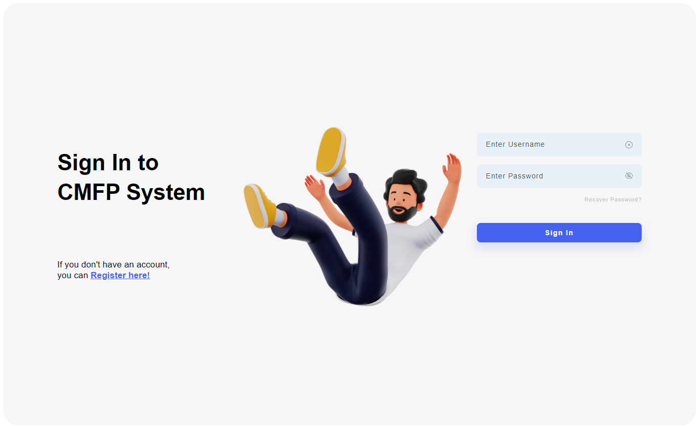
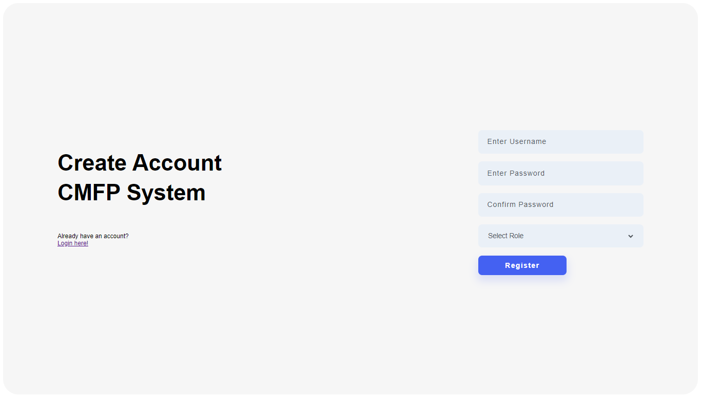

# Node.js Login & Signup System

This is a simple login and signup system built with Node.js and MongoDB.

## Features
- User sign up and login
- Data stored in MongoDB
- Basic validation and error handling

### Login Page


### Create Account Page


## Installation

1. Clone the repository:
   ```bash
   git clone 
   ```

2. Install dependencies:
   ```bash
   cd project-name
   npm install
   ```

3. Set up MongoDB URI in `.env`:
   ```bash
   MONGODB_URI=your_mongo_db_connection_string
   ```

4. Run the application:
   ```bash
   npm start
   ```

## License
This project is licensed under the MIT License - see the [LICENSE](LICENSE) file for details.
